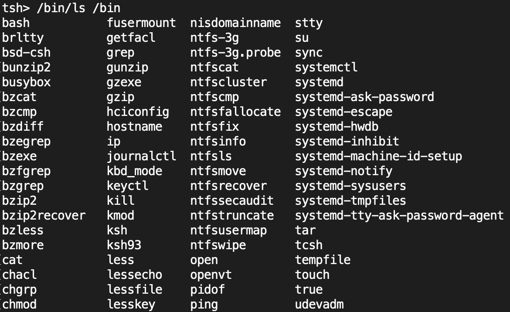

# Simple Unix Shell

A shell is a tool that allows users to access their computer's operating system services through a simple interface. The shell allows us to control our computer by commands typed on our keyboards rather than using a GUI. One of the main benefits of a shell is that you can perform operations that you generally cannot perform using the GUI, for example, deleting locked files.
The simple shell that I have created here was done in order to achieve a deeper understanding of process control and signaling, specifically in C.

 
## Getting Started

In order to run the Simple Unix Shell, firstly, you must clone the repository on your local machine. You can do this by running the following line on your machine's CLI:

```git clone https://github.com/SafiyaJan/Simple-Unix-Shell.git```

### Prerequisites

Ensure that you run the Shell on a Linux machine, as some of the libraries required by the shell are not compatible on other operating systems.

### Installing

 - In order to create the Shell executable, type the follwing command on your machine's CLI:
```make```
 - To run the Shell, type the follwing command on your machine's CLI:
```./tsh```

### Usage

- The shell supports all commands that are present under ```/bin``` directory including primitive commands such ```ls, cat, mkdir and chmod```

#### Example 1 - Running the ```ls``` command

Below you can see a partial list of all the commands that the shell can handle and this was done by running the command following commands:
```
./tsh
tsh> /bin/ls /bin 
``` 


#### Example 2 - Running an executable within the shell 

If you have an executable within the same directory as the shell, you can run that executable under the shell. For example, the executable ```myspin1``` can be run as a background process by running the following command:
```
./tsh
tsh> ./myspin1 &   # the ampersand runs that executable in the background
``` 
The process can also be killed by sending a kill signal on the process by running the following command:

```
tsh> /bin/kill -9 <PID> #PID is the ID of the process
```


#### Example 3 - Displaying the current running jobs 

The shell provides a builtin command, ```jobs``` that displays all the processes that are currently running. You can use this command by executing a bunch of different commands and typing ```jobs``` to get back a list of all the jobs that are being done.


